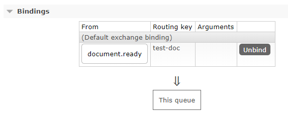

# jrcc-document-access-libs

This library provides a service to store documents using [redis](https://redis.io/) cache.

## Road Map

* [X] Store a document in redis cache
* [ ] Retrieve document from redis cache
* [X] Publish a document ready message to rabbitMq
* [ ] Subscribe when a document is ready from rabbitMq

## jrcc document access spring boot starter

This provide a spring boot starter for the document access lib using [redis](https://redis.io/)

### Usage

Add `jrcc-access-spring-boot-starter` to your project

```xml
<dependency>
    <groupId>ca.bc.gov.open</groupId>
    <artifactId>jrcc-access-spring-boot-starter</artifactId>
    <version>0.6.0</version>
</dependency>
```

Add settings into `application.settings` file using the following configuration guide

## Plugins

### Common Options

| name | definition | required |
| --- | --- | --- |
| [bcgov.access.input.document-type](#bcgovaccessinputdocument-type) | String | No |
| [bcgov.access.input.plugin-type](#bcgovaccessinputplugin-type) | String | Yes |

#### bcgov.access.input.document-type

* Value type is String
* Default value is `unknown`

Sets the document type to be manipulated

#### bcgov.access.input.plugin-type

* Value type is String

Sets the plugin type

## Input Plugins

You can configure the document input using `bcgov.access.input` property.

* [Console](#ConsoleInputPlugin)
* [Http](#HttpInputPlugin)
* [RabbitMq](#RabbitMqInputPlugin)
* [Sftp](#sftpInputPlugin)

### Console Input Plugin

#### Description

Reads document form the standard input.
Each document is assumed to be one line

#### Configuration

```properties
bcgov.access.input.plugin=console
```

#### Input Configuration Options

There are no special configuration options for this plugin, but it does support the [Common Options](#CommonOptions).

### Http Input Plugin

#### Description

Using this input you can receive a single document over http(s).
For more details have a look at the [document API](jrcc-access-api/jrcc.swagger.yml).

#### Setup

```properties
bcgov.access.input.plugin=http
```

You can configure the webserver using standard spring configuration.
Document sent to the api are handle with the default documentReadyHandler.

#### Configuration Options

There are no special configuration options for this plugin, but it does support the [Common Options](#CommonOptions) and spring standard EMBEDDED SERVER CONFIGURATION (ServerProperties).
[Common Application Properties](https://docs.spring.io/spring-boot/docs/current/reference/html/common-application-properties.html)

exemple to run the service on port `5050`

```properties
server.port=5050
```


### RabbitMq Input Plugin

#### Description

Using this plugin you can receive messages from a specified rabbitMq queue.

#### Setup

```properties
bcgov.access.input.plugin=rabbitmq
```

#### Configuration Options

It support the [Common Options](#CommonOptions) and the following options:

| name | type | required |
| --- | --- | --- |
| [bcgov.access.input.rabbitmq.retryDelay](#bcgovaccessinputrabbitmqretryDelay) | Int | No |
| [bcgov.access.input.rabbitmq.retryCount](#bcgovaccessinputrabbitmqretryCount) | Int | No |

##### bcgov.access.input.rabbitmq.retryDelay

* Value type is Int
* Default value is `0`

Sets the delay in seconds between retries when the service if failing to process the message and throwing application known errors.

##### bcgov.access.input.rabbitmq.retryCount

* Value type is Int
* Default value is `1`

Sets the maximum attempt to reprocess a message in the queue.

# Sftp Input Plugin

#### Description

Using this plugin you can receive messages from a specified Sftp server.

#### Setup

```properties
bcgov.access.input.plugin=sftp
```

#### Configuration Options

It support the [Common Options](#CommonOptions) and the following options:

| name | type | required |
| --- | --- | --- |
| [bcgov.access.input.sftp.host](#bcgovaccessinputsftphost) | String | N |
| [bcgov.access.input.sftp.port](#bcgovaccessinputsftpport) | Int | N |
| [bcgov.access.input.sftp.username](#bcgovaccessinputsftpport) | String | Yes |
| [bcgov.access.input.sftp.password](#bcgovaccessinputsftpport) | String | Yes |

##### bcgov.access.input.sftp.host

* Value type is String
* Default value is `localhost`

Sets the sftp server host

##### bcgov.access.input.sftp.port

* Value type is Int
* Default value is `22`

Sets the sftp server port

##### bcgov.access.input.sftp.username

* Value type is String

Sets the sftp server username

##### bcgov.access.input.sftp.password

* Value type is String

Sets the sftp server password

## Output Plugins

You can configure the document input using `bcgov.access.output` property.

* [Console](#ConsoleOutputPlugin)
* [RabbitMq](#RabbitMqOutputPlugin)

### Console Output Plugin

#### Description

A simple output wich pring document information to STDOUT.
The console output is mostly used when testing the application configuration.

#### Setup

```properties
bcgov.access.output.plugin=console
```

#### Configuration Options

It support the [Common Options](#Common Options) and the following options:

| name | type | required |
| --- | --- | --- |
| [bcgov.access.output.console.format](#bcgovaccessoutputconsoleformat) | String | No |

##### bcgov.access.output.console.format

* Value type is String
* Default value is `default`
* Value can be any of `default`, `xml`

When set to `default` the output is truncated to 100 chars.
When set to `xml` the plugins tries to prettify the xml document or return the content of the document

````properties
bcgov.access.output.console.format=xml
````

### RabbitMq Output Plugin

#### Description

Push documents to a RabbitMq exchange and store document to Redis Cache.

#### Setup

```properties
bcgov.access.output.plugin=rabbitmq
```

#### Configuration Options

It support the [Common Options](#Common Options) and the following options:

| name | type | required |
| --- | --- | --- |
| [bcgov.access.output.rabbitmq.ttl](#bcgovaccessoutputrabbitmqttl) | Int | No |

##### bcgov.access.output.rabbitmq.ttl

* Value type is Int
* Default value is `1`

Sets the time to live for document in the temporary storage (expressed in hours)

```properties
bcgov.access.output.rabbitmq.ttl
```

## Processor

you can register a processor to transform the content of the message.

To register a processor do the following

Create a new spring component that implements [DocumentProcessor](jrcc-document-access-libs/src/main/java/ca/gov/bc/open/jrccaccess/libs/processing/DocumentProcessor.java)

```java
@Component
public class UpperCaseProcessor implements DocumentProcessor {

	@Override
	public String processDocument(String content, TransactionInfo transactionInfo) {
		return content.toUpperCase(Locale.CANADA);
	}
}
```

Where register, the processor will act on the input document content.

## References

* [Spring Boot Autoconfiguration for Spring AMQP (RabbitMQ)](https://docs.spring.io/spring-boot/docs/current/reference/html/boot-features-messaging.html#boot-features-amqp)
* [Spring Data Redis](https://docs.spring.io/spring-data/data-redis/docs/current/reference/html/)

## Sample App

The sample app is a demo that shows the usage of `jrcc-access-spring-boot-starter`

Install jrcc-access-libs

Run the `make.bat` file

Run the sample

```bash
mvn clean install -P sample-app
mvn spring-boot:run -f jrcc-access-spring-boot-sample-app/pom.xml
```

This app is configure to receive document using the http plugin.

you can use this [Postman collection](jrcc-access-api/jrcc-document-api.postman_collection.json) to interact with the server.

For body, select binary and click select file
set the http header to `Content-Type:application/octet-stream`


if you want to run the sample app using redis and rabbitmq do the following

Create a redis container

```bash
docker run --name some-redis -p 6379:6379 -d redis
```
Create a rabit container

```bash
docker run -d --hostname some-rabbit --name some-rabbit -p 15672:15672 -p 5672:5672 rabbitmq:3-management
```

update the [application.yml](jrcc-access-spring-boot-sample-app/src/main/resources/application.yml)

```properties
bcgov:
  access:
    input: http
    output:
      document-type: test-doc
      plugin: rabbitmq
      rabbitmq:
         ttl: 1
logging:
  level:
    ca:
      gov:
        bc: DEBUG
```

To view the message in a queue, login to [rabbitmq management console](http://localhost:15672) with default guest/guest and create a binding to the `document.ready` exchange using `test-doc` routing key



## Release

To create a new release run on develop branch

```
mvn versions:set -DartifactId=*  -DgroupId=*
```

it will prompt you for the new version

do a pull request against dev
